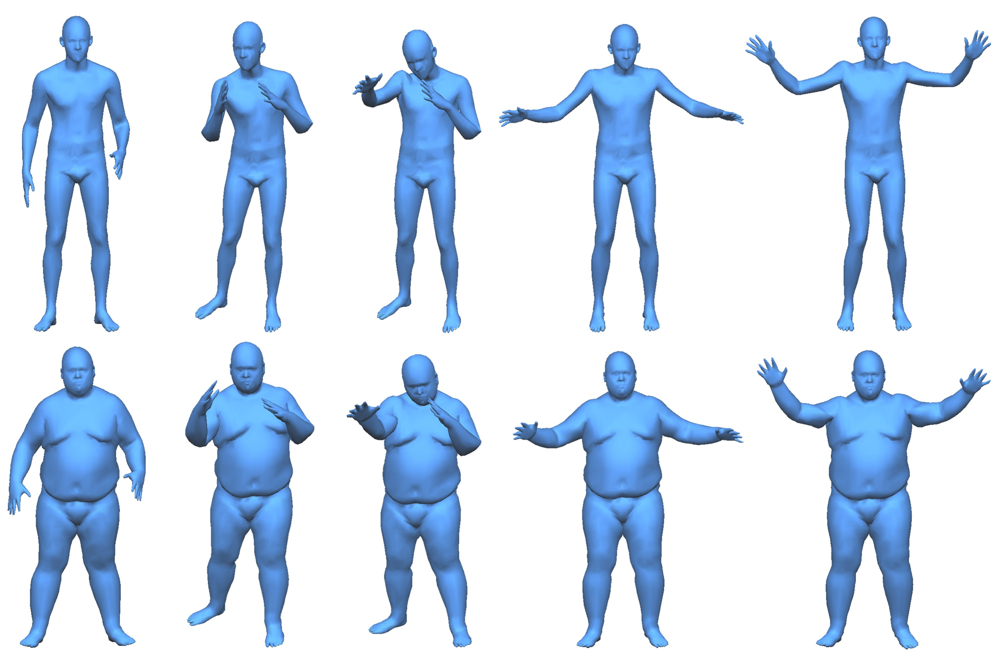

# [Automatic-Unpaired-Shape-Deformation-Transfer](https://geometrylearning.com)
Code for "Automatic Unpaired Shape Deformation Transfer", Siggraph Asia 2018
<p align='center'>  
  
</p>
We will include more details soon.

## Note for VC-Gan 
- Linux
- Python 2 or 3
- NVIDIA GPU (larger than 8G) + CUDA cuDNN


## Note for ACAP Lib

### Prerequisites
- Windows, Linux comming soon.
### Dependencies
- Install [GUROBI Optimizer 8.0](http://www.gurobi.com/)
- Install [OpenMesh 7.0](https://www.openmesh.org/download/)
- Install [Matlab 2017b](https://www.mathworks.com/)
- Install [GMM 5.2](http://getfem.org/download.html)
- Install [CoMISo](https://graphics.rwth-aachen.de:9000/CoMISo/CoMISo) VS2017 Complied
- Install [Eigen 3.3.3](http://eigen.tuxfamily.org/index.php?title=Main_Page)


## Citation

If you find this useful for your research, please use the following.

```
@article {gaovcgan2018,
     author = {Gao, Lin and Yang, Jie and Qiao, Yi-Ling and Lai, Yu-Kun and Rosin, Paul L and Xu, Weiwei and Xia, Shihong},
     title = {Automatic Unpaired Shape Deformation Transfer},
     journal = {ACM Transactions on Graphics (Proceedings of ACM SIGGRAPH Asia 2018)},
     year = {2018},
     volume = {37},
     pages = {To appear},
     number = {6}

```
